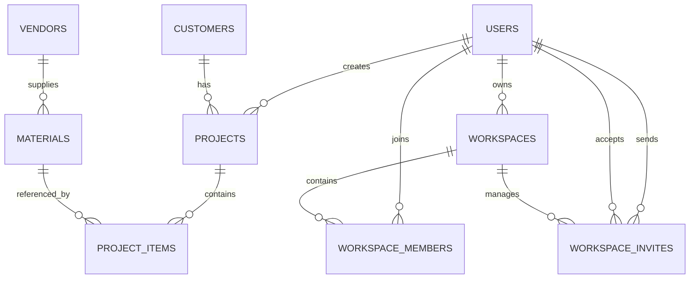

# BuilderPro Database Flow

## Overview
The BuilderPro database is designed around two main concerns:

1. **construction estimating data**
   - customers
   - vendors
   - materials
   - projects
   - project line items
2. **team access and collaboration**
   - users
   - workspaces
   - workspace members
   - workspace invites

The schema is defined in:
- `supabase/migrations/20260301000000_create_initial_schema.sql`
- `supabase/migrations/20260326010000_add_workspaces_and_invites.sql`

The SQLAlchemy mirror of that schema lives in:
- `backend/app/models/models.py`

> Important: the backend intentionally avoids `Base.metadata.create_all()` in production. Migration history in `supabase/migrations/` is the source of truth.

---

## High-level flow

```text
Supabase Auth -> backend auth routes -> local users/workspaces tables
                                     -> business tables for materials/projects/items
Frontend screens -> FastAPI endpoints -> PostgreSQL/Supabase data -> typed JSON responses
```

---

## Core tables and purpose

| Table | Purpose |
|---|---|
| `users` | App-level user profile and role (`admin` or `user`) |
| `customers` | Companies/clients tied to projects |
| `vendors` | Material suppliers |
| `materials` | Catalog of items with price, unit, waste defaults, and vendor link |
| `projects` | Top-level estimate/project records |
| `project_items` | Material line items within a project |
| `workspaces` | Company/team container |
| `workspace_members` | Many-to-many user membership per workspace |
| `workspace_invites` | Email invite tokens for onboarding users |

---

## Relationship flow



---

## Authentication and workspace flow

### 1) Sign in
Route: `POST /api/auth/signin`

Flow:
1. frontend submits email/password
2. backend calls Supabase Auth (`/auth/v1/token?grant_type=password`)
3. backend looks up or creates a matching row in `users`
4. backend checks `workspace_members` for the user’s role and workspace
5. frontend stores the returned session token and role info

### 2) Company signup
Route: `POST /api/auth/signup-company`

Flow:
1. create auth account in Supabase
2. insert or update `users`
3. create a `workspaces` row for the company
4. create a `workspace_members` row with role `admin`
5. return workspace metadata to the client

### 3) Invite flow
Routes:
- `POST /api/auth/invites`
- `POST /api/auth/join-invite`

Flow:
1. workspace admin creates an invite
2. a row is inserted into `workspace_invites`
3. invite token is sent/shared externally
4. invited user signs up with the token
5. backend validates token, email, and expiry
6. backend creates/updates `users`
7. backend inserts `workspace_members`
8. invite row is marked as accepted

---

## Estimating and project data flow

### Step 1: master data setup
Before estimates are useful, admins typically create:
- `vendors`
- `materials`
- `customers`

This gives the app reusable pricing and contact information.

### Step 2: create a project
A `projects` row stores:
- project name
- customer link
- status (`draft`, `active`, `closed`)
- default tax percentage
- default waste percentage
- optional creator (`created_by`)

### Step 3: add project items
Each row in `project_items` references:
- one `project`
- one `material`

It also stores snapshot values:
- `unit_type`
- `unit_cost`
- `waste_pct`
- `total_qty`
- `line_subtotal`

This is important because estimate history should not change just because a material price changes later.

### Step 4: calculations
The app uses these formulas:

```text
total_qty = quantity × (1 + waste_pct / 100)
line_subtotal = total_qty × unit_cost
```

These values are stored directly in `project_items` for faster reporting and stable historical pricing.

---

## Integrity rules built into the schema

### Check constraints
The database enforces several guardrails:
- user/workspace roles must be `admin` or `user`
- project status must be `draft`, `active`, or `closed`
- `quantity > 0`
- `unit_cost >= 0`
- `waste_pct >= 0`
- `default_tax_pct >= 0`
- `default_waste_pct >= 0`

### Foreign key behavior
- deleting a project **cascades** to its `project_items`
- deleting a material is **restricted** if it is already used by a project item
- deleting a workspace **cascades** to members and invites

This protects estimate data from accidental corruption.

---

## Performance choices
Indexes were added for common lookups such as:
- materials by category or vendor
- projects by customer, status, and creator
- project items by project and material
- workspace members by workspace or user
- workspace invites by workspace, email, and expiry

These indexes support the app’s main list and detail screens efficiently.

---

## Practical database lifecycle in this project

1. schema changes are added as SQL files in `supabase/migrations/`
2. backend models in `backend/app/models/models.py` stay aligned with the SQL schema
3. FastAPI endpoints read/write through SQLAlchemy sessions
4. frontend pages call the API client in `frontend/src/services/api.ts`
5. responses return typed JSON objects back to the UI

---

## Current state note
Right now, the backend and database flow are real, but parts of the frontend still use local seed state in `frontend/src/hooks/useStore.tsx`. That means the database design is ready for live use, while the UI integration is still being completed.

---

## Bottom line
The database is structured to support a **construction estimating workflow with team collaboration**, while keeping:
- pricing history stable
- data constraints strict
- auth and workspace ownership organized
- future growth easier through migration-based schema management
