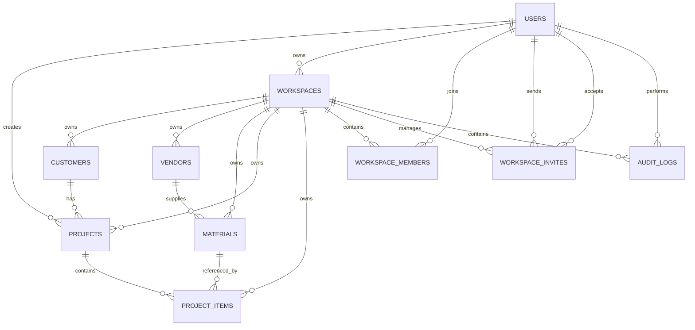

# BuilderPro Database Architecture (Updated)

## Overview
BuilderPro uses a migration-first relational schema for two connected domains:

1. Construction estimating and purchasing
2. Workspace-based collaboration and access control

The SQL source of truth is the migration history in `supabase/migrations/`.
The ORM mirror is in `backend/app/models/models.py`.

Important: in production, schema changes should come from migrations, not from ORM auto-creation.

---

## What Is New
Since the initial database documentation, these capabilities were added:

1. Strict workspace scoping across all business tables
2. Order lifecycle state on project items (`draft`, `ordered`, `received`, `cancelled`)
3. Purchasing metadata on project items (PO number, purchase notes, ordered/received timestamps)
4. Workspace audit logging for admin/security visibility

These changes come from:
- `20260406010000_add_workspace_id_to_business_tables.sql`
- `20260406020000_enforce_workspace_not_null_and_scoped_uniques.sql`
- `20260406030000_add_order_status_to_project_items.sql`
- `20260406040000_add_purchase_metadata_to_project_items.sql`
- `20260406040000_create_audit_logs.sql`

---

## Component Map (What Each Table Does)

| Component | Table | What it does |
|---|---|---|
| Identity | `users` | Local user profile and app role (`admin` or `user`) linked to auth identity |
| Tenant boundary | `workspaces` | Represents a company/team; all business data belongs to one workspace |
| Membership | `workspace_members` | Connects users to workspaces with role-based membership |
| Onboarding | `workspace_invites` | Invite token flow for adding users to a workspace |
| CRM-lite | `customers` | Client records used by project estimates |
| Supplier data | `vendors` | Vendor/supplier records for materials procurement |
| Catalog | `materials` | Price catalog, unit type, SKU, waste defaults, and optional vendor link |
| Estimate header | `projects` | Project-level estimate metadata, customer, status, and defaults |
| Estimate lines + purchasing | `project_items` | Line items with quantity math, snapshot pricing, and purchasing lifecycle fields |
| Auditability | `audit_logs` | Immutable event log for membership/invite/admin actions |

---

## Relationship Flow



---

## Data Flows You Can Present

### 1) Auth + Workspace Session Flow
Routes:
- `POST /api/auth/signin`
- `POST /api/auth/signup-company`
- `POST /api/auth/invites`
- `POST /api/auth/join-invite`

Flow summary:
1. Supabase validates credentials or creates auth user
2. Backend upserts `users`
3. Workspace context is resolved from `workspace_members`
4. Invite and membership changes are persisted in workspace tables
5. Relevant admin actions are logged to `audit_logs`

### 2) Estimating Flow
1. Create shared master data: `vendors`, `materials`, `customers`
2. Create `projects` with tax/waste defaults
3. Add `project_items` for each material line
4. Persist computed values for stable historical estimates:

```text
total_qty = quantity * (1 + waste_pct / 100)
line_subtotal = total_qty * unit_cost
```

### 3) Purchasing Flow (New)
`project_items` now carry purchasing state and metadata:
- `order_status`: draft -> ordered -> received (or cancelled)
- `po_number`
- `purchase_notes`
- `ordered_at`
- `received_at`

This turns each estimate line item into a lightweight purchasing tracker without needing a separate orders table yet.

---

## Multi-Tenant Enforcement (New)
Workspace isolation is now enforced in both API behavior and schema rules.

### Schema-level guarantees
1. `workspace_id` exists on all core business tables
2. `workspace_id` is `NOT NULL` on those tables
3. Workspace-scoped uniqueness is enforced:
   - vendor name unique per workspace
   - material SKU unique per workspace (when SKU exists)

### Why this matters
This prevents cross-company data leakage and allows different workspaces to reuse the same names/SKUs safely.

---

## Audit Logging (New)
`audit_logs` records who did what, in which workspace, and when.

Core fields:
- `workspace_id`
- `user_id` (nullable for deleted users)
- `action`
- `resource_type`
- `resource_id`
- `details`
- `created_at`

Current backend usage includes events such as:
- member invited
- member joined
- member role updated
- member removed

This supports admin transparency, security reviews, and future compliance/reporting needs.

---

## Integrity Rules
Examples of enforced constraints:
- roles are restricted to `admin` or `user`
- project status is restricted to `draft`, `active`, `closed`
- order status is restricted to `draft`, `ordered`, `received`, `cancelled`
- quantity and monetary/waste defaults are non-negative (or positive where required)

Foreign key behavior includes:
- deleting a project cascades to `project_items`
- deleting a workspace cascades to members, invites, and audit logs
- deleting a material is restricted if project items still reference it

---

## Performance and Indexing
Indexes support main query paths such as:
- workspace-filtered list endpoints
- project status filtering
- material category filtering
- order status and PO lookup
- ordered/received date reporting
- audit timeline by workspace and user

---

## Migration Timeline

1. `20260301000000_create_initial_schema.sql`
2. `20260326010000_add_workspaces_and_invites.sql`
3. `20260406010000_add_workspace_id_to_business_tables.sql`
4. `20260406020000_enforce_workspace_not_null_and_scoped_uniques.sql`
5. `20260406030000_add_order_status_to_project_items.sql`
6. `20260406040000_add_purchase_metadata_to_project_items.sql`
7. `20260406040000_create_audit_logs.sql`

---

## One-Minute Presentation Summary
BuilderPro's database evolved from a basic estimating schema into a multi-tenant, workspace-safe system. The latest additions introduced strict workspace ownership, purchasing lifecycle tracking on project items, and audit logging for admin actions. Together, these changes improve data isolation, operational visibility, and readiness for scaling across multiple companies.
